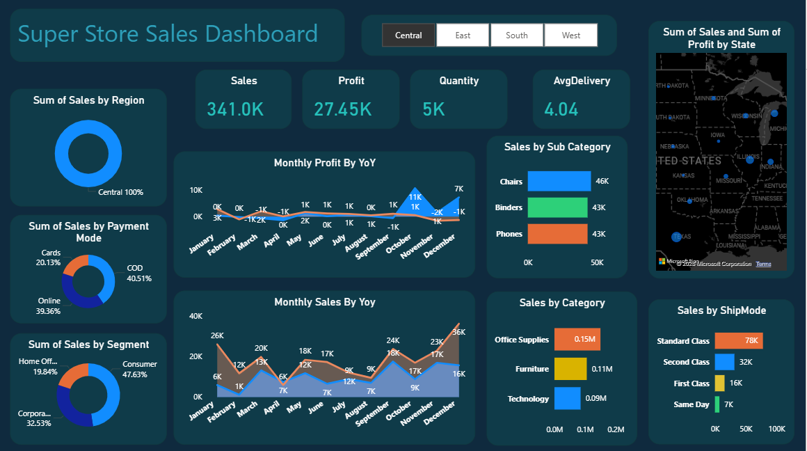
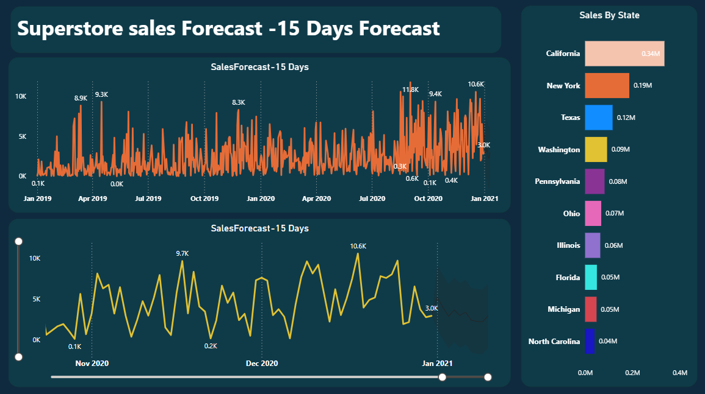

# 📊 SuperStore Sales Dashboard

## 📌 Project Overview

This project is an interactive Power BI dashboard built using the SuperStore Sales dataset. It provides comprehensive business insights into sales performance, profitability, customer behavior, regional trends, and shipping performance through interactive visualizations.

---

## 🚀 Features

- 📈 Sales & Profit Analysis
- 🌍 Regional Performance Analysis
- 🛍️ Category & Sub-Category Analysis
- 👥 Customer Segment Analysis
- 💳 Payment Mode Analysis
- 🚚 Shipping Mode Analysis
- 📅 Monthly Sales & Profit Trends
- 📊 KPI Cards
- 🎛️ Interactive Filters & Slicers

---

## 🛠️ Tools & Technologies

- Power BI
- Power Query
- DAX
- Microsoft Excel

---

## 📂 Dataset

- SuperStore Sales Dataset

---

## 📷 Dashboard Preview

### Page 1



### Page 2



---

## 📈 Key Performance Indicators (KPIs)

- Total Sales
- Total Profit
- Total Quantity Sold
- Average Delivery Time

---

## 📁 Repository Contents

```text
📂 SuperStore_Sales_Dashboard
│── 📄 SalesDashboard.pbix
│── 📄 SuperStore_Sales_Dataset.csv
│── 🖼️ SalesDashboard.png
│── 🖼️ SalesDashboard2.png
│── 📄 README.md
```

---

## 🎯 Business Objective

The dashboard helps businesses monitor sales performance, identify profitable categories, evaluate regional performance, analyze customer purchasing patterns, and support data-driven decision-making.

---

## 👩‍💻 Author

**Vandna Sahu**

GitHub: https://github.com/vandnasahu
